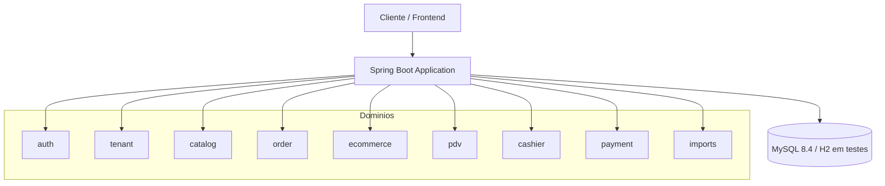

# SaaS de Gestão de Comércio

Sistema de gestão para comércio e e-commerce em arquitetura monolítica modular, com foco em multi-tenancy, segurança, controle operacional e integridade de dados. O projeto combina autenticação JWT, contexto de tenant, fluxo de pedidos, PDV, caixa, pagamentos e processamento massivo de catálogo com concorrência segura.

## Visão geral

Este projeto foi pensado para representar um sistema realista de gestão comercial em um ambiente SaaS, com isolamento de dados por loja/empresa e regras de negócio alinhadas a operações de varejo, atendimento físico e vendas online.

Entre os principais pontos da solução estão:

- isolamento de dados por tenant
- autenticação stateless com JWT
- concorrência correta em estoque e transações compartilhadas
- fluxo de pedidos e pagamentos com validações de integridade
- PDV com mesas/comandas e fechamento de caixa
- importação de produtos em massa com processamento em chunks e Virtual Threads
- testes automatizados com perfil de banco em memória

## Arquitetura

A aplicação adota uma arquitetura monolítica modular, mantendo separação por domínio e evitando acoplamento técnico desnecessário entre módulos.



### Módulos principais

- auth: autenticação, autorização e geração de JWT
- tenant: contexto do tenant e regra de isolamento por empresa
- catalog: produtos, categorias e controle de estoque
- order: pedidos e regras de composição do pedido
- ecommerce: fluxo de compra digital e carrinho
- pdv: mesas, comandas, atendimento e fechamento de mesa
- cashier: abertura/fechamento do caixa e conciliação
- payment: pagamentos e validação de saldos e pagamentos pendentes
- imports: upload e processamento de CSV para catálogo em lote

## Regras de negócio e integridade

### Multi-tenancy

A aplicação exige que o tenant do usuário seja carregado a partir do token JWT e propagado para todas as operações de banco. O contexto é tratado de forma segura via `TenantContext`, evitando que uma operação absorva dados de outro cliente.

A estrutura da solução reforça que:

- o tenant nunca é aceito como parâmetro externo do cliente
- as entidades base carregam o tenant de forma explícita
- consultas e alterações respeitam o tenant ativo em todas as camadas

### Concorrência e consistência

O projeto foi desenvolvido com atenção ao problema clássico de read-modify-write e à corrida de concorrência em cenários compartilhados.

Exemplos incorporados na lógica:

- ajuste atômico de estoque com validação no banco
- bloqueio/serialização em operações sensíveis de pagamento
- versão otimista em estado compartilhado de mesas/PDV
- processamento de importação em chunks para reduzir pressão de memória
- atualizações finais de status do job persistidas de forma consistente

### Importação em massa

O módulo de importação foi projetado como fluxo robusto para cargas grandes:

- upload de arquivo com persistência local antes do retorno
- leitura em chunks para processamento incremental
- execução paralela com Virtual Threads
- contadores por job e isolamento de erros por linha
- persistência de erros para diagnóstico sem abortar o restante da carga
- regra de negócio de recebimento de quantidade: soma ao estoque atual

## Stack tecnológica

| Componente | Tecnologia |
|---|---|
| Linguagem | Java 21 |
| Framework | Spring Boot 3.3.4 |
| Persistência | Spring Data JPA + JDBC |
| Banco de produção | MySQL 8.4 |
| Banco de testes | H2 em memória |
| Migrations | Flyway |
| Segurança | Spring Security + JWT |
| API docs | Springdoc OpenAPI |
| Concorrência | Virtual Threads (Java 21) |
| Testes | JUnit 5, AssertJ, MockMvc, Spring Boot Test |
| Containers | Docker Compose |

## Pré-requisitos

- Java 21
- Maven Wrapper incluído no projeto
- Docker e Docker Compose

## Execução local

### 1. Subir infraestrutura

```bash
docker compose up -d
```

### 2. Rodar a aplicação

Linux/macOS:

```bash
./mvnw spring-boot:run
```

Windows:

```powershell
./mvnw.cmd spring-boot:run
```

A aplicação será exposta em:

- http://localhost:8080

### 3. Acesso à documentação da API

- Swagger UI: http://localhost:8080/swagger-ui.html
- OpenAPI: http://localhost:8080/v3/api-docs

## Testes

O projeto usa perfil de teste com H2 para garantir execução isolada e consistente em CI/local.

Execução completa:

```bash
./mvnw test
```

Windows:

```powershell
./mvnw.cmd test
```

Validação realizada neste ambiente:

- comando executado: ./mvnw.cmd test -q
- resultado verificado: exit code 0

Isso confirma que a suíte atual está passando no ambiente local de desenvolvimento/validação.

## Boas práticas aplicadas

- separação por domínio e responsabilidade
- transações explícitas em operações críticas
- contexto de tenant propagado com segurança
- validação de regras antes da persistência
- uso de SQL atômico em pontos sensíveis de estoque
- processamento em lote com isolamento de falhas por linha
- testes focados em comportamento real e integração

## Benchmarking e performance

Esta aplicação foi desenhada para priorizar correção e integridade antes de throughput bruto, mas o projeto já incorpora arquitetura e padrões que favorecem desempenho em cenários de carga real:

- processamento em chunks para reduzir memória e picos de GC
- Virtual Threads para paralelizar importações e tarefas longas
- consultas atômicas para operações de estoque e atualização de estado
- redução de acoplamento e bloqueios desnecessários em camada de serviço

### Estratégia recomendada de benchmark

Para medir desempenho real, o ideal é executar cenários em ambiente próximo ao de produção, com dados representativos:

1. importação de catálogo de 5k, 50k e 500k linhas
2. concorrência em estoque para cenários de múltiplos clientes simultâneos
3. abertura/fechamento de caixa e pedidos em alta concorrência
4. carga de PDV e mesas/comandas em operações de leitura e escrita

### Comandos sugeridos

```bash
./mvnw test
```

```bash
docker compose up -d
```

```bash
./mvnw spring-boot:run
```

> Os benchmarks devem ser coletados em um ambiente controlado e repetível, com métricas de tempo de resposta, throughput, uso de CPU e consumo de memória. Não há números de produção aqui porque o objetivo desta documentação é registrar a estratégia, padrões e validação de comportamento, e não inventar resultados sem medição real.

## Visão de maturidade

O projeto já incorpora uma base sólida para um SaaS comercial de porte médio, com foco em integridade operacional, segurança por tenant e execução de processos em alta escala. O alinhamento com Java 21, Spring Boot, banco relacional e processamento paralelo torna a solução adequada tanto para estágio de validação técnica quanto para evolução contínua de novos módulos e APIs.

## Conclusão

A entrega atual representa uma base funcional e robusta para gestão comercial, cobrindo autenticação, tenancy, pedidos, PDV, caixa, pagamentos e importação em lote. O diferencial principal está na combinação de regras de negócio firmes, tratamento de concorrência real e execução paralela sem comprometer a consistência do sistema.
