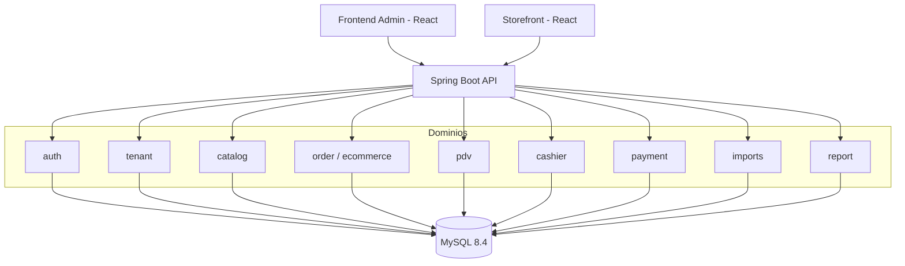

# 🏪 SaaS de Gestão de Comércio & E-commerce

**Um monólito modular Java 21 + Spring Boot 3 que resolve, de verdade, os problemas difíceis de um SaaS multi-tenant de varejo:** isolamento de dados por cliente, concorrência segura em estoque e caixa, importação em massa com Virtual Threads, e um fluxo completo de vendas que vai do PDV físico ao checkout do e-commerce.

Não é um CRUD de tutorial. É um sistema pensado para o cenário real de uma rede de lojas: múltiplos tenants isolados, múltiplos operadores por loja, vendas simultâneas no PDV e na loja virtual, caixa sendo fechado enquanto pagamentos ainda chegam, e planilhas de 50 mil produtos sendo importadas sem travar a API.


---

## 📑 Sumário

- [Visão geral](#-visão-geral)
- [Arquitetura](#-arquitetura)
- [Stack tecnológica](#-stack-tecnológica)
- [Multi-tenancy: isolamento real de dados](#-multi-tenancy-isolamento-real-de-dados)
- [Segurança e autenticação](#-segurança-e-autenticação)
- [Módulos e funcionalidades](#-módulos-e-funcionalidades)
- [Os problemas difíceis que este sistema resolve](#-os-problemas-difíceis-que-este-sistema-resolve)
- [Frontend administrativo](#-frontend-administrativo)
- [Storefront (loja virtual)](#-storefront-loja-virtual)
- [Banco de dados e migrations](#-banco-de-dados-e-migrations)
- [Testes automatizados](#-testes-automatizados)
- [Documentação da API](#-documentação-da-api)
- [Como rodar o projeto](#-como-rodar-o-projeto)
- [Visão de maturidade](#-visão-de-maturidade)

---

## 🔎 Visão geral

O sistema cobre o ciclo operacional completo de um comércio: **cadastro de produtos → venda (PDV ou loja virtual) → pagamento → caixa → relatórios**, com um módulo à parte para **importação em massa de catálogo**. Tudo isolado por tenant (empresa/loja), com autenticação stateless via JWT e regras de negócio que tratam concorrência como cidadã de primeira classe, não como afterthought.

Principais pilares:

- 🏢 **Isolamento de dados por tenant** aplicado na camada do Hibernate, não "na mão" em cada query
- 🔐 **Autenticação JWT stateless** com RBAC por papel (Admin, Vendedor, Caixa, PDV)
- ⚙️ **Concorrência correta** em estoque, caixa e mesas — testada com testes concorrentes reais (múltiplas threads), não apenas testes felizes
- 🛒 **Fluxo de pedidos unificado** entre PDV físico e e-commerce
- 🍽️ **PDV com mesas/comandas** e fechamento de caixa com conciliação
- 📦 **Importação de produtos em massa** via CSV, processada em chunks com Virtual Threads (Java 21)
- 📊 **Dashboard de relatórios** com faturamento, ticket médio, novos clientes e operação, em tempo real
- 🧪 **Testes automatizados** cobrindo cenários de concorrência, isolamento de tenant e regressão de segurança

---

## 🏗️ Arquitetura

Monólito modular: módulos de domínio bem separados dentro de uma única aplicação Spring Boot, evitando tanto o acoplamento de um "big ball of mud" quanto a complexidade operacional prematura de microsserviços.



Duas aplicações React consomem a mesma API: um **painel administrativo** (autenticado, multi-perfil) e um **storefront público** (sem login, tenant fixo).

---

## 🧰 Stack tecnológica

| Camada | Tecnologia |
|---|---|
| Linguagem | Java 21 |
| Framework | Spring Boot 3.3.4 |
| Persistência | Spring Data JPA + JDBC (batch/atômico) |
| Banco de produção | MySQL 8.4 |
| Banco de testes | H2 em memória |
| Migrations | Flyway |
| Segurança | Spring Security + JWT (jjwt) |
| Concorrência | Virtual Threads (Java 21) + `CompletableFuture` |
| Resiliência | Resilience4j (retry com backoff exponencial) |
| Documentação de API | Springdoc OpenAPI / Swagger UI |
| Frontend admin | React 19 + Vite 8 |
| Storefront | React 19 + Vite 8 |
| Testes backend | JUnit 5, AssertJ, MockMvc, Spring Boot Test |
| Testes frontend | Vitest |
| Containers | Docker Compose |

---

## 🏢 Multi-tenancy: isolamento real de dados

Este não é um isolamento "de fachada" feito por convenção em cada repositório. O tenant é resolvido **uma única vez**, a partir do JWT autenticado, e propagado via `TenantContext` (ThreadLocal). A partir daí, o **próprio Hibernate** aplica o filtro:

- Toda entidade de negócio estende `BaseEntity`, que carrega um campo `@TenantId` (recurso nativo do Hibernate 6.4+)
- Um `TenantIdentifierResolver` injeta o tenant corrente em **toda** query/insert automaticamente — não existe `WHERE tenant_id = ?` espalhado (e esquecível) pelo código
- O tenant **nunca** é aceito como parâmetro vindo do cliente (nem body, nem query string) — só existe se vier de dentro de um JWT validado
- Para as rotas públicas do storefront (sem login), um `StorefrontTenantFilter` dedicado força um tenant fixo configurado via `storefront.tenant-id`, rodando **depois** do filtro de JWT — isso corrige, de forma auditada e coberta por teste de regressão, um cenário real em que um JWT válido de outro tenant poderia vazar o catálogo de outra loja para o storefront público

Coberto por testes dedicados: `MultiTenancyDataIsolationTest` (prova que dados do tenant A nunca aparecem para o tenant B) e `StorefrontTenantFilterIntegrationTest` (prova que o vazamento acima está corrigido).

---

## 🔐 Segurança e autenticação

- **JWT stateless** (HMAC, `io.jsonwebtoken`): token carrega `tenantId`, `userId`, `role` e `name`, expira em 24h, chave configurável via variável de ambiente em produção
- **RBAC por papel**: `ROLE_ADMIN`, `ROLE_SELLER`, `ROLE_CASHIER`, `ROLE_USER`, aplicado via `@PreAuthorize` em cada endpoint (ex.: exclusão de produto é admin-only, fechamento de caixa é admin/caixa, importação é admin-only)
- **Sessões stateless**, CSRF desabilitado (API pura), CORS restrito, rotas públicas explícitas (`/auth/**`, `/storefront/**`, Swagger) — todo o resto exige autenticação
- Cadeia de filtros: `JwtAuthenticationFilter` → `TenantFilter` → `StorefrontTenantFilter`

---

## 📦 Módulos e funcionalidades

### `auth` — Autenticação e equipe
- `POST /api/v1/auth/register-tenant` — cria um novo tenant + usuário admin inicial
- `POST /api/v1/auth/login` — autentica e retorna JWT
- `GET /api/v1/auth/me` — dados do usuário autenticado
- `POST /api/v1/auth/change-password` — troca de senha
- `GET /api/v1/users` — lista a equipe do tenant

### `tenant` — Dados da empresa
- `GET /api/v1/tenants/me` / `PUT /api/v1/tenants/me` — leitura e atualização dos dados do tenant (nome, documento, plano)

### `catalog` — Produtos e categorias
- CRUD completo de produtos (`/api/v1/products`) com paginação, filtro por categoria/busca/status
- `PATCH /api/v1/products/{id}/stock` — ajuste **atômico** de estoque (entrada/saída), sem race condition
- CRUD de categorias (`/api/v1/categories`)
- Catálogo público espelhado para o storefront (`/api/v1/storefront/products`), forçando `status=ACTIVE` e usando DTO próprio (nunca expõe campos administrativos)

### `order` / e-commerce — Pedidos, carrinho e checkout
- Modelo de pedido **unificado** entre PDV e e-commerce (`channel`: `PDV` ou `ECOMMERCE`)
- Carrinho autenticado (`/api/v1/ecommerce`) e público (`/api/v1/storefront/cart`), com endereço de entrega e limpeza automática pós-compra
- Checkout completo (`/api/v1/ecommerce/checkout/{customerId}` e versão pública) validando método de envio, endereço (quando é entrega) e forma de pagamento
- Listagem administrativa de pedidos com filtro por status/canal/busca (`GET /api/v1/orders/admin`)

### `pdv` — Ponto de venda, mesas e comandas
- Venda direta de balcão (`POST /api/v1/pdv/sales`)
- Mesas/comandas completas: abrir mesa, adicionar item, fechar mesa e converter em pedido
- Reabertura de mesa reaproveita o número da mesa (não duplica registros) e limpa itens/total anteriores
- Fechamento converte a comanda em um `Order` de canal PDV, debitando estoque de forma atômica

### `cashier` — Caixa
- Abertura/fechamento de caixa com **um único caixa aberto por tenant** (garantido também por índice único no banco, não só na aplicação)
- Fechamento soma pagamentos reais (dinheiro vs. cartão/Pix) desde a abertura e calcula divergência de conciliação (`cashDifference`, `cardDifference`)
- Totais do caixa aberto são recalculados em tempo real a partir dos pagamentos, nunca de um campo "preguiçoso" desatualizado
- Histórico paginado de caixas (`GET /api/v1/cashier/registers`)

### `payment` — Pagamentos
- Registro de pagamento (`POST /api/v1/payments`) com trava de linha do pedido, validação de valor residual e transição automática do pedido para `COMPLETED` quando o total é quitado
- Impede pagamento em pedido cancelado, valores zerados/negativos ou acima do saldo devedor

### `imports` — Importação em massa de catálogo
- Upload de CSV (`POST /api/v1/imports/upload`, multipart, admin-only), persistido em disco antes do retorno
- Processamento **assíncrono em Virtual Threads** (`Executors.newVirtualThreadPerTaskExecutor()`), em **chunks de 500 linhas**, cada chunk rodando em paralelo
- Upsert em lote via JDBC puro (`batchUpdate`, `INSERT ... ON DUPLICATE KEY UPDATE`) — reimportação é idempotente e soma ao estoque atual
- Validação linha a linha, com erros persistidos individualmente (`ImportJobError`) sem abortar o restante da carga
- Retry automático (Resilience4j, 3 tentativas, backoff exponencial) em deadlock/timeout de banco
- Contadores de processamento atualizados de forma atômica (`x = x + ?`) para não perder incrementos entre chunks concorrentes
- Qualquer falha não tratada força o job para `FAILED` — nenhum job fica "preso" em `PROCESSING` para sempre
- Acompanhamento de status e listagem paginada de erros por job

### `report` — Dashboard de relatórios
- `GET /api/v1/reports/dashboard?period=TODAY|LAST_7_DAYS|LAST_30_DAYS`
- Faturamento, número de pedidos, ticket médio, novos clientes, receita por canal (PDV vs. e-commerce), série diária de faturamento
- Bloco operacional: produtos ativos/sem estoque/rascunho, arquivos e linhas importadas hoje (com erros), mesas ocupadas no momento
- Pedidos cancelados são explicitamente excluídos dos números de faturamento

---

## 🧠 Os problemas difíceis que este sistema resolve

Qualquer CRUD faz cadastro. O que separa um sistema "de produção" de um tutorial é como ele se comporta sob concorrência real — e isso foi tratado como requisito, não como detalhe:

- **Estoque sem race condition**: ajuste de estoque via `UPDATE ... WHERE stock_quantity + delta >= 0` em uma única instrução SQL — testado com 10 threads simultâneas decrementando o mesmo produto, sem perder nenhuma atualização
- **Caixa sem abertura duplicada**: lock pessimista na linha do tenant + índice único no banco garantindo um único caixa aberto por vez, mesmo sob duas requisições simultâneas
- **Pagamento sem overpayment**: lock pessimista na linha do pedido antes de validar o saldo residual, eliminando a corrida clássica de dois pagamentos simultâneos "furando" o valor total
- **Mesas sem duplicidade**: upsert atômico (`INSERT ... ON DUPLICATE KEY UPDATE`) protegido por constraint única de `(mesa, produto)`, e fechamento de mesa protegido por controle de versão otimista (`@Version`)
- **Importação sem corrupção de contadores**: chunks paralelos em Virtual Threads incrementando contadores via SQL atômico, para que múltiplos workers não sobrescrevam o progresso um do outro

Todos os cenários acima têm teste de concorrência dedicado (múltiplas threads reais, não mocks) comprovando o comportamento — não é uma alegação de README, é comportamento verificado em `ProductStockConcurrencyTest`, `CashierFlowIntegrationTest` e `PdvTableSessionIntegrationTest`.

---

## 🖥️ Frontend administrativo

React 19 + Vite, painel único com navegação por abas e **RBAC no próprio frontend** (matriz de permissões que espelha os papéis do backend):

- **Dashboard** — números reais consumidos do endpoint de relatórios
- **PDV** — tela de mesas/comandas
- **Produtos** — gestão de catálogo
- **Pedidos** — listagem administrativa
- **Caixa** — abertura, fechamento e histórico
- **Importação** — upload de CSV com acompanhamento de progresso e lista de erros
- **Configurações** — dados do tenant e da equipe

Ações sensíveis (criar/editar/excluir produto, convidar membro da equipe, fechar caixa, enviar importação) são bloqueadas por papel também na interface — não apenas no backend. Testado com Vitest, incluindo um conjunto específico de testes de segurança/regressão de permissões.

---

## 🛍️ Storefront (loja virtual)

Aplicação React separada, pública, sem login — simula a loja virtual de um cliente final ("Aurora Mercearia"):

- Vitrine com filtro por categoria e busca textual, página de detalhe do produto com relacionados
- Identidade do cliente via id persistido no navegador (sem necessidade de conta)
- Carrinho sincronizado com o servidor, com proteção contra requisições concorrentes duplicadas (AbortController)
- Escolha de entrega (entrega padrão com frete grátis acima de R$250, ou retirada na loja) e forma de pagamento (Pix, cartão, na entrega)
- Checkout com proteção contra duplo clique/duplo envio (`checkoutInFlight`)
- Tela de confirmação de pedido com acompanhamento simulado de entrega/retirada

---

## 🗄️ Banco de dados e migrations

Schema 100% controlado por Flyway (`ddl-auto: validate` — o Hibernate nunca altera o schema por conta própria):

| Migration | Conteúdo |
|---|---|
| `V1__initial_schema.sql` | Schema inicial completo: tenants, usuários, categorias, produtos, pedidos/itens, mesas/comandas, caixa, pagamentos, jobs de importação |
| `V2__cash_register_status.sql` | Status de caixa + índice único garantindo um único caixa aberto por tenant |
| `V3__product_extended_fields.sql` | Campos de custo, status e descrição em produtos |
| `V4__ecommerce_checkout_fields.sql` | Endereço de entrega e forma de pagamento em pedidos |
| `V5__restaurant_table_item_unique_product.sql` | Constraint única `(mesa, produto)` habilitando upsert atômico de itens |
| `V6__cash_register_reconciliation_fields.sql` | Campos de conciliação (diferença em dinheiro/cartão) e controle de versão otimista |

---

## 🧪 Testes automatizados

17 arquivos de teste, combinando unitários e de integração (Spring Boot Test + H2 em memória):

- **Unitários**: serviço de JWT, categorias, produtos, pedidos, contexto de tenant
- **Integração**: autenticação, fluxo completo de caixa, catálogo, importação, carrinho/checkout, venda PDV, sessão de mesas, dashboard de relatórios, isolamento de tenant, filtro de tenant do storefront
- **Concorrência real** (múltiplas threads, não mocks): estoque, abertura/fechamento duplicado de caixa, overpayment, fechamento/adição concorrente em mesas
- **Casos de borda notáveis**: limite de meia-noite no relatório diário, divisão por zero no ticket médio, retorno 403 correto por papel em cada módulo sensível

```bash
./mvnw.cmd test
```

---

## 📖 Documentação da API

- **Swagger UI**: http://localhost:8080/swagger-ui.html
- **OpenAPI JSON**: http://localhost:8080/v3/api-docs

Todos os endpoints documentados com `@Tag` por domínio e `@Operation` por rota, com esquema de segurança Bearer/JWT global — rotas públicas (auth, storefront) explicitamente marcadas sem exigência de token.

---

## ▶️ Como rodar o projeto

**Pré-requisitos**: Java 21, Docker e Docker Compose, Node.js (para os frontends).

```bash
# 1. Sobe o MySQL
docker compose up -d

# 2. Sobe o backend (Windows: ./mvnw.cmd spring-boot:run)
./mvnw spring-boot:run
# API em http://localhost:8080

# 3. Sobe o painel administrativo
cd frontend && npm install && npm run dev
# http://localhost:5173

# 4. Sobe o storefront
cd storefront && npm install && npm run dev
# http://localhost:5174
```

---

## 📈 Visão de maturidade

Este projeto foi construído para representar a base técnica de um SaaS comercial real de porte médio: autenticação, isolamento por tenant, PDV, caixa, pagamentos, e-commerce e importação em lote convivendo em um único monólito modular, com atenção deliberada a concorrência, integridade de dados e cobertura de teste — em vez de otimizar só pelo "funciona no happy path".

---

*Desenvolvido como projeto de portfólio, com foco em engenharia de backend para sistemas multi-tenant de alta concorrência.*
