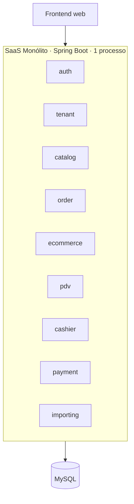
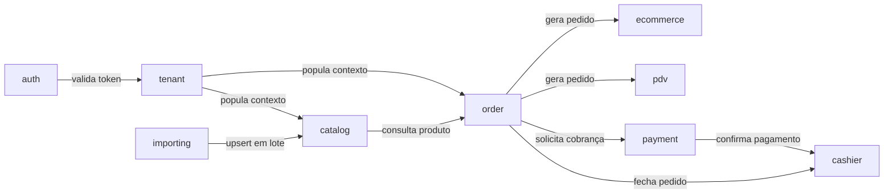
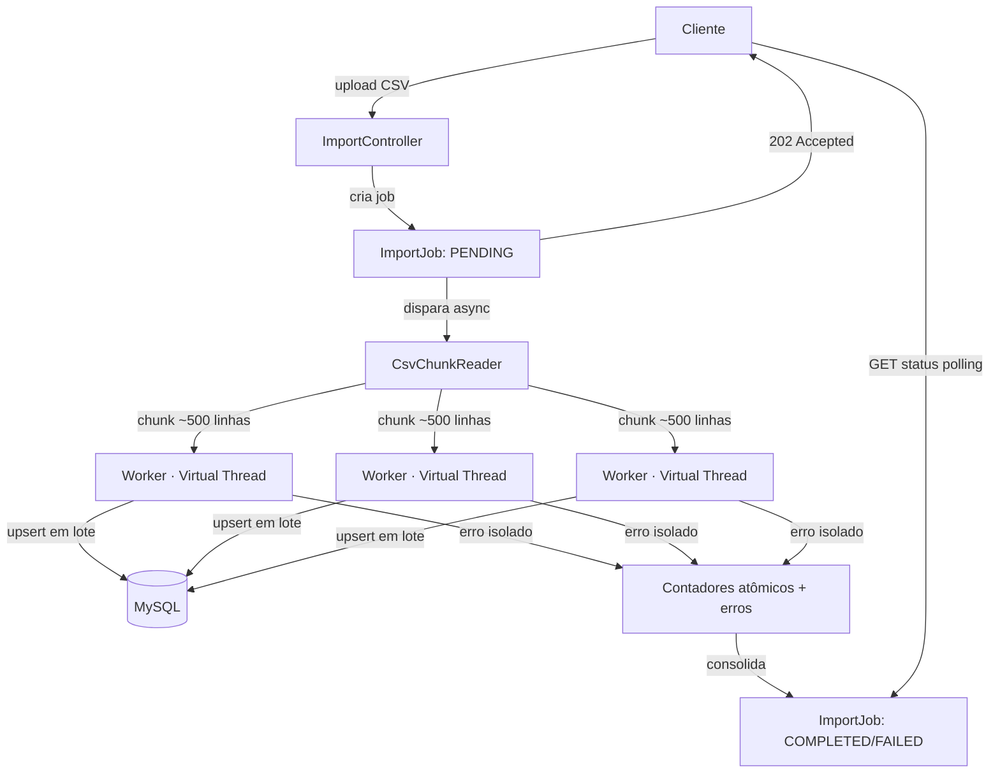

# SaaS de Gestão de Comércio & E-commerce

Plataforma de gestão para quem vende — loja física, online, ou as duas coisas ao mesmo tempo. Catálogo de produtos, carrinho e checkout de e-commerce, PDV com mesas/comandas, e fechamento de caixa com conciliação de pagamentos. Multi-tenant: várias empresas usam o mesmo sistema, cada uma com seus dados completamente isolados das outras.

Construído como monólito modular — decisão consciente de arquitetura, não limitação. O objetivo deste projeto é demonstrar domínio de regra de negócio complexa e centralizada, e concorrência real em Java, sem se apoiar em coordenação distribuída entre serviços.

## Índice

- [Stack técnica](#stack-técnica)
- [Arquitetura](#arquitetura)
- [Multi-tenancy](#multi-tenancy)
- [Módulos](#módulos)
- [O diferencial: importação paralela com Virtual Threads](#o-diferencial-importação-paralela-com-virtual-threads)
- [Concorrência: decisões de engenharia e o que já quebrou](#concorrência-decisões-de-engenharia-e-o-que-já-quebrou)
- [Como rodar localmente](#como-rodar-localmente)
- [Testes](#testes)
- [Limitações conhecidas e próximos passos](#limitações-conhecidas-e-próximos-passos)
- [Benchmark](#benchmark)

## Stack técnica

| Camada | Tecnologia |
|---|---|
| Linguagem | Java 21 LTS |
| Framework | Spring Boot 3.3.4 (Data JPA, Security, Validation, JDBC) |
| Banco (dev/prod) | MySQL 8.4 via Docker Compose |
| Banco (testes) | H2 em memória (modo MySQL) |
| Migrations | Flyway |
| Autenticação | JWT stateless (JJWT 0.12.6) |
| Resiliência | Resilience4j |
| Documentação de API | SpringDoc OpenAPI / Swagger UI |
| Testes | JUnit 5, Mockito, AssertJ, MockMvc |

## Arquitetura

### Visão geral (deployment)



Um único deployable: um processo Spring Boot, um único banco. Não há rede entre módulos — toda comunicação interna é chamada de método direta, sem mensageria. Isso contrasta com uma arquitetura de microsserviços coreografada via eventos (SNS/SQS) que também faz parte do meu portfólio, como ponto de comparação de trade-offs arquiteturais.

### Dependências entre módulos



`importing` é o único módulo que escreve em `catalog` fora do fluxo normal de CRUD — de propósito, para manter a fronteira de concorrência isolada num só lugar. `ecommerce` e `pdv` nunca se comunicam entre si diretamente; ambos delegam para `order`, que concentra a regra de negócio compartilhada entre canais de venda.

### Pipeline da importação paralela



## Multi-tenancy

Isolamento estrito via `@TenantId` do Hibernate 6.4+, centralizado na superclasse `BaseEntity`. O `tenantId` é extraído do JWT por um filtro (`TenantFilter`), armazenado num `TenantContext` (ThreadLocal) por requisição, e resolvido para o Hibernate via um `CurrentTenantIdentifierResolver` dedicado — nunca aceito diretamente do payload ou query string do cliente.

O `@PrePersist` da `BaseEntity` falha explicitamente (`IllegalStateException`) se qualquer entidade tentar ser persistida sem um tenant ativo no contexto — preferindo falha alta e imediata a um fallback silencioso que mascare um bug de propagação de contexto.

Um teste de integração dedicado (`MultiTenancyDataIsolationTest`) prova isolamento na leitura, não só na escrita: cria dados para dois tenants diferentes e confirma que um nunca enxerga dados do outro, mesmo em consultas que não filtram tenant explicitamente no código da aplicação.

**Atenção especial em processamento assíncrono:** Virtual Threads não herdam o `ThreadLocal` da requisição que as originou. Cada worker do módulo de importação propaga o `tenantId` manualmente no início da sua execução — e, como o upsert em massa usa SQL puro via `JdbcTemplate` (não JPA), o filtro automático do Hibernate não se aplica ali; o `tenant_id` é passado explicitamente como parâmetro em cada instrução.

## Módulos

| Módulo | Responsabilidade |
|---|---|
| `auth` | Registro de tenant + usuário administrador, login, emissão e validação de JWT |
| `tenant` | Entidade raiz de isolamento, contexto de tenant por requisição |
| `catalog` | Produtos e categorias, com ajuste de estoque atômico |
| `order` | Regra de pedido compartilhada entre canais de venda (e-commerce e PDV) |
| `ecommerce` | Carrinho e checkout |
| `pdv` | Venda direta no caixa e mesas/comandas persistidas |
| `cashier` | Abertura/fechamento de caixa com reconciliação de pagamentos |
| `payment` | Registro de pagamento vinculado ao ciclo de vida do pedido |
| `importing` | Importação massiva de catálogo com processamento paralelo (o diferencial técnico do projeto) |
| `common` | Entidade base, tratamento de exceções centralizado, DTOs compartilhados |

## O diferencial: importação paralela com Virtual Threads

Um lojista sobe uma planilha CSV com milhares de produtos. Em vez de processar linha a linha:

1. O arquivo é persistido em disco de forma síncrona antes da resposta HTTP retornar (`202 Accepted` com o id do job) — evitando depender do arquivo temporário do multipart, que não sobrevive ao fim da requisição
2. O processamento roda de forma assíncrona, lendo o arquivo em streaming e dividindo em chunks de ~500 linhas
3. Cada chunk é processado numa **Virtual Thread** (`Executors.newVirtualThreadPerTaskExecutor()`) — permitindo milhares de tarefas concorrentes sem o custo de memória de threads de sistema operacional
4. A persistência usa `INSERT ... ON DUPLICATE KEY UPDATE` em lote via `JdbcTemplate.batchUpdate` — atômico por construção no nível do banco, eliminando qualquer janela de corrida entre chunks concorrentes tentando o mesmo SKU
5. Falha de uma linha (ou de um lote inteiro, por erro de banco) é isolada: registrada individualmente, sem derrubar o processamento dos demais chunks
6. Erros transitórios de banco (deadlock, timeout) acionam retry automático via Resilience4j — restrito estritamente a esse tipo de erro, nunca a falha de validação de negócio
7. Contadores de progresso (`processedRows`, `successCount`, `errorCount`) são atualizados via `UPDATE ... SET coluna = coluna + ?` — incremento atômico no banco, permitindo consulta de progresso real durante o processamento, não só ao final

## Concorrência: decisões de engenharia e o que já quebrou

Esse projeto foi construído com revisão técnica ativa em cada fase — e vale documentar os problemas reais encontrados no caminho, porque a forma como foram corrigidos diz mais sobre a engenharia do projeto do que qualquer feature isolada.

- **Ajuste de estoque:** a primeira versão lia o valor, somava em Java e salvava — um clássico *lost update* sob concorrência. Corrigido com `UPDATE` atômico condicional no banco, verificando linhas afetadas.
- **Checkout com múltiplos itens:** precisava garantir que, se um item do carrinho falhasse por falta de estoque, os itens já debitados antes dele revertessem. Provado com um teste que força a ordem de processamento e confirma reversão determinística — não um teste que "passa por acaso" dependendo da ordem de iteração de um `Map`.
- **Fechamento concorrente de mesa (PDV):** duas tentativas de fechar a mesma comanda ao mesmo tempo podiam gerar dois pedidos e debitar estoque em dobro. Resolvido com lock otimista (`@Version` + `OPTIMISTIC_FORCE_INCREMENT`) e provado com um teste de duas threads reais disputando o mesmo recurso via `CountDownLatch`.
- **Abertura concorrente de caixa:** duas aberturas simultâneas para o mesmo tenant podiam coexistir. Resolvido com defesa em profundidade — lock pessimista na linha do tenant *e* uma constraint de unicidade no banco via coluna gerada — e também provado com concorrência real disparada via HTTP.
- **Upsert da importação em massa:** a primeira versão fazia `SELECT` seguido de `INSERT`/`UPDATE` em código de aplicação — reintroduzindo exatamente a mesma classe de corrida, só que entre Virtual Threads. Substituído por `INSERT ... ON DUPLICATE KEY UPDATE`, atômico por construção — a única correção deste projeto que elimina a corrida sem precisar de um teste de concorrência para prová-la, porque a garantia vem do próprio motor do banco.

O critério usado em todo o projeto: um teste que passa não prova ausência de condição de corrida — só prova a lógica sequencial. Onde a atomicidade importa de verdade, o teste precisa forçar concorrência real.

## Como rodar localmente

```bash
# subir o banco
docker compose up -d

# rodar a aplicação
./mvnw spring-boot:run

# rodar a suíte de testes completa
./mvnw clean test
```

Documentação interativa da API disponível em `/swagger-ui.html` após subir a aplicação.

## Testes

Cobertura em três camadas: unitários (regra de negócio isolada com Mockito), integração (fluxo completo via `MockMvc` contra H2), e concorrência real (múltiplas threads reais disputando o mesmo recurso via `CountDownLatch`, usadas especificamente onde atomicidade não pode ser assumida por simples leitura de código).

## Limitações conhecidas e próximos passos

Transparência sobre o que ainda não está pronto, em vez de esconder:

- **Pagamento concorrente:** dois pagamentos parciais simultâneos para o mesmo pedido ainda podem, em teoria, somar além do total devido — falta aplicar o mesmo padrão de lock já usado na abertura de caixa, desta vez na linha do `Order`
- **Relatórios:** métricas agregadas por período, canal e produtos mais vendidos ainda não foram implementadas
- **Granularidade de erro no import em lote:** uma falha de banco isolada num sub-lote de 100 linhas marca o sub-lote inteiro como erro, não só a linha problemática — trade-off consciente em favor de performance (`rewriteBatchedStatements`), documentado aqui em vez de deixado implícito
- **Frontend:** o projeto é intencionalmente API-only neste momento, testável via Swagger UI

## Benchmark

*A preencher após execução real: tempo de importação sequencial vs. paralela para um volume comparável de produtos, com o número de workers utilizado.*
